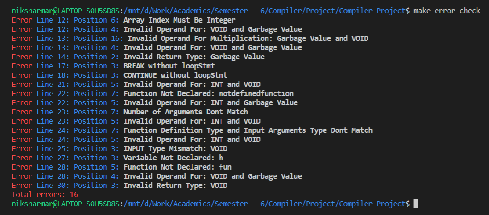
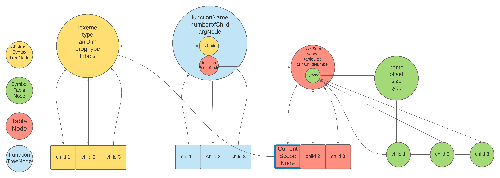

## SeeSPIM Compiler ⭐

This project implements a Compiler for a language similar to C. The Compiler takes as input program written in the language and generates MIPS assembly code that can be run on SPIM or simulators like MARS.

## Table of Contents :scroll:

Codebase Directory<br>
Tokens<br>
Grammer<br>
Basic Features<br>
Advanced Features<br>
Installation Requirements<br>
Instructions to Run<br>
Example Programs<br>
Structs Explanation<br>
Future Work<br>
References and Credits<br>
Team Members<br>


## Codebase Directory: 📁
```
Compiler-Project
├─ AST.c
├─ AST.h
├─ Makefile
├─ README.md
├─ assembly.c
├─ assembly.h
├─ grammer.txt
├─ images
│  ├─ compiler_struct.png
│  └─ error_output.png
├─ parser.y
├─ test_programs
│  ├─ binary_search_program.see
│  ├─ block_and_scope_program.see
│  ├─ complex_expressions_program.see
│  ├─ conditional_statements_program.see
│  ├─ error_check_program.see
│  ├─ function_calls_program.see
│  ├─ loops_breaks_continue_program.see
│  ├─ multi_dimensional_array_program.see
│  ├─ recursion_with_memoization_dp_program.see
│  ├─ recursive_factorial_program.see
│  ├─ strings_program.see
│  └─ ternary_operators_program.see
├─ tok.l
└─ tokens.txt
```

## Tokens :nazar_amulet:

Firstly following regular expression variables have been defined. These are self-explanatory.

| Regex Variable | Regex |
| :---: | :---: |
| DIGIT | [0-9] | 
| LETTER | [a-zA-Z_] | 
| SINGLE_LINE_COMMENT | "//"[^\n]* | 
| MULTI_LINE_COMMENT | "/*"[^*/]*"*/"  | 
| STRING_REGEX | "\\""(.)*"\\"" | 


Now, the following tokens are defined in the order given below in the lexer.

| Regex | Token Returned | English Explanation |
| :---: | :---: | :---: |
| {SINGLE_LINE_COMMENT} |  | Single Line Comment |
|  {MULTI_LINE_COMMENT} |  | Multiline Comment |
|  {STRING_REGEX} | STRINGVAL | String Value |
| "Newline" | NEWLINE | NewlineCustom Function |
| "break" | BREAK	| Break statement	|
| "char" | CHAR	 | Character type	|
| "string"	  | STRING  | String type |     	
| "continue"  |  CONTINUE  | Continue statement             	|
| "else"  | ELSE   	| Else statement |
| "for"	   | FOR        | For loop    | 	
| "if"	   | IF        | If statement  |   	
| "int"	       | INT  |     Integer type | 	
| "return" | RETURN |    Return from a function            	|
| "void"	| VOID       | Void type         	|
| "while"	 | WHILE    | While loop           	|
| "input"	 | INPUT     | For input          	|
| "output"    | OUTPUT | For output|
| \{LETTER\}(\{LETTER\}\|\{DIGIT\})* | IDENTIFIER | Variable name |
| {DIGIT}+ | INT | Integer value |
| '(\\\\[t0n'"\\\\]\|[^\\\\'])' | CHAR | Character value |
"&&"	| AND		| AND comparison|
"\|\|" | OR			| OR comparison|
"<="	| LE		| Less than or equal to comparison|
">="	 | GE		| Greater than or equal to comparison|
"=="		| EQ	| Equal to comparison|
"!="		| NE	| Not equal to comparison|
";"         | SEMICOLON | Semicolon|
("{")	| 	LBRACE	|  Curly bracket operning|
("}")	|   RBRACE		| Curly bracket closing|
","		| COMMA		| Comma|
"="	    | ASSIGN	| Assignment operator		|
"("    | LPAREN		| Opening round parentheses|
")"		| RPAREN	| Closing round parentheses	|
("[")		| LBRACKET	| Opening square bracket|
("]")	| RBRACKET    | Closing square bracket|
"&"		| BITAND	| Bitwise AND operation	|
"!"		| NOT	 | Not operator	|
"-"		| MINUS	 | Minus operator|	
"+"		| PLUS	| Plus operator	|
"*"		| MUL	| Multiply operator|
"/"		| DIV	| Divide Operator	|
"%"		| MOD	| Modulo operator|
"<"		| LT	| Less than comparion|
">"		| GT	| Greater than comparison|
"^"		| XOR	| Bitwise XOR operation|
"\|"		| BITOR	| Bitwise OR operation |
"?" |   IF | If for ternary operator |
":" |  COLON | Colon for ternary operator |
[ \t\v\n\f]	 | | Do nothing|
.    | | Do nothing |

## Grammer :notebook:

```prog``` is the root node in grammer. This represents the entire program. The program can go to a declare statement, a function declare statement or more programs. It cannot be empty.

```

prog: declStmt
| funDeclStmt
| declStmt prog
| funDeclStmt prog
```
A function definition will have its name, declaration of zero or more arguments and body.

```
funDeclStmt: funName incScope LPAREN declArg RPAREN LBRACE stmts RBRACE decScope
| funName incScope LPAREN RPAREN LBRACE stmts RBRACE decScope			
```

In a declare statement, multiple variables of same types can be declared. Hence, for a particular type we can declare a list of identifiers.

```

declStmt: type identifiersList SEMICOLON
```
A function name will have it's return type and actual name of the function
```
funName: type IDENTIFIER
```
The four basic types that we support are int, char, void and string.

```
type: INT
| CHAR
| VOID
| STRING
```

Arguments of a function are one or more identifiers that are comma separated.

```
declArg: declArg COMMA type identifiers
| type identifiers
```

An identifier / variable can be a single variable or a list of comma separated variables.

```
identifiersList: identifiers
| identifiersList COMMA identifiers
```

An identifier can be a variable or a multidimensional array.

```
identifiers: IDENTIFIER
| IDENTIFIER multiDim
```

Multi dimensional array can have one or more dimensions. While declaring the size of array must be an integer.

```
multiDim: multiDim LBRACKET NUM_CHAR RBRACKET
| LBRACKET NUM_CHAR RBRACKET
```

Statements can be one or more statement.
```
stmts: stmt   				
| stmts stmt 
```

A statement can be a loop, if else, declare statement, expression, control flow, input/output i.e. custom function, or more statements in curly braces (used by else in if).

```
stmt: incScope LBRACE stmts RBRACE decScope	
| controlflowStmt 
| loopStmt  
| ifelseStmt 
| declStmt 
| customFunc
| exprStmt
```

Control flow statements can be break, continue or return.

```
controlflowStmt:  BREAK SEMICOLON 
| CONTINUE SEMICOLON	
| RETURN SEMICOLON
| RETURN expression SEMICOLON
```

Loop statements can be while loops or for loops. For loops are of two type. One with all three expression statements (e.g. ```for(exp1;exp2;exp3)```) and one with first two expression statements (e.g. ```for(exp1;exp2;)```). 

```
loopStmt: FOR incScopeFor LPAREN exprStmt exprStmt expression RPAREN LBRACE stmts RBRACE decScope
| FOR incScopeFor LPAREN exprStmt exprStmt RPAREN LBRACE stmts RBRACE decScope
| WHILE incScopeFor LPAREN expression RPAREN LBRACE stmts RBRACE decScope 
```
These are used for incrementing and decrementing scope in loops, if else and functions definition statements.
```
incScopeFor: %empty
incScope: %empty	
decScope: %empty	
```

If else statement can be just an if statement or it can be an if else statement. It supports multiple else, else if in the else part. Conditional statements can also be of type ternary operators that support only expressions in true/false part and arithmetic expression in condition part.
```
ifelseStmt: IF LPAREN expression RPAREN incScope LBRACE stmts RBRACE decScope
| IF LPAREN expression RPAREN incScope LBRACE stmts RBRACE decScope ELSE stmt
| arithmeticExpr incScope TERNERY expression COLON expression decScope
```
Custom functions are input, output and newline. Inpute and output take identifier and it's type which are comma seperated. Newline function does not take any arguments.
```
customFunc: INPUT LPAREN type COMMA IDENTIFIER RPAREN SEMICOLON
| OUTPUT LPAREN type COMMA IDENTIFIER RPAREN SEMICOLON
| NEWLINE LPAREN RPAREN SEMICOLON
```
An expression statement can be an expression with semicolon or just semicolon (empty expression).
```
exprStmt: expression SEMICOLON
| SEMICOLON
```
An expression can be an arithmetic expression, a string or an assignment expression.
```
expression : arithmeticExpr
| STRINGVAL
| unaryExpr ASSIGN expression
```
Arguments used while calling a function can be multiple expressions that are comma separated. 
```
callArg: expression	
| callArg COMMA expression
```


Arithmetic expression can be a unary expression or mathematical operation between two arithmetic expressions.
```
arithmeticExpr: unaryExpr
| arithmeticExpr MUL arithmeticExpr
| arithmeticExpr DIV arithmeticExpr
| arithmeticExpr MOD arithmeticExpr
| arithmeticExpr MINUS arithmeticExpr 	
| arithmeticExpr LE arithmeticExpr
| arithmeticExpr GE arithmeticExpr
| arithmeticExpr LT arithmeticExpr
| arithmeticExpr GT arithmeticExpr 
| arithmeticExpr EQ arithmeticExpr
| arithmeticExpr NE arithmeticExpr 
| arithmeticExpr BITAND arithmeticExpr
| arithmeticExpr XOR arithmeticExpr
| arithmeticExpr BITOR arithmeticExpr 
| arithmeticExpr AND arithmeticExpr
| arithmeticExpr OR arithmeticExpr
```

Unary operators can be minus or bitwise not.
```
unaryOperator: MINUS
| NOT 				
```
Unary expression can an identifier, number, string, expression within parantheses (scope), function call with no arguments, function call with arguments, unary expression with a unary operator, single dimensional array access using expression, multidimensional array access.
```
unaryExpr: IDENTIFIER
| NUM_CHAR
| STRINGVAL
| LPAREN expression RPAREN        	
| IDENTIFIER LPAREN RPAREN
| IDENTIFIER LPAREN callArg RPAREN 
| unaryOperator unaryExpr 
| IDENTIFIER LBRACKET expression RBRACKET
| IDENTIFIER multiAccess 
```

For multidimensional array access only static integers can be used.
```
multiAccess: multiAccess LBRACKET NUM_CHAR RBRACKET
| LBRACKET NUM_CHAR RBRACKET

```

## Basic Features ✅
- **Data Types:** Integers `int`, Character `char`, Array of `int` and `char` are allowed. The single dimensional array allows an expression or an integer to be its arguments. Further the multidimensional part is given in advanced features. The syntax of the arrays is same as C language. String is another data type with its own functionality given in detail in advanced features.

- **Declaration of Variables:** Declare a variable like ```type identifer```, where type are `int` or `char`. More complex declarations allowed are given below:

    - ```int x,y,z[100];```
    - ```char t,k[1000],u;```
    - ```int x[5];```
    - ```int x[89], y[66];```
    - One cannot assign a value to the variable in the same statement as declaration.

- **Conditional Statements:** `if`, `else if`, `else` statements are allowed.

    - ```if(a+b <= func(x*x, t)) { ... } else { ... }```
    - ```if(a+b <= func(x*x, t)) { ... } else if(p > q+r) { ... } else if(p < q+r) {...}```
    - ```if(a+b <= func(x*x, t)) { ... } else if(a > b*p) { ... } else {..}```

- **Relational Operators:** All the basic relational operators are allowed:
    - Equal `==`
    - Not Equal `!=`
    - Less Than `<`
    - Greater Than `>`
    - Less Than Equal To `<=`
    - Greater Than Equal To `>=`


- **Boolean Operators:** All the basic boolean operators are allowed on conditional expressions.
    - Or `||`
    - And `&&`
    - Not `!`

- **Arithmetic Operators:** All the basic arithematic operators are allowed.
    - Add `+`
    - Subtract `-`
    - Multiply `*`
    - Divide `/`
    - Modulus Operator `%`
    - Bitwise Or `|`
    - Bitwise And `&`
    - Bitwise Xor `^`
    - Unary Minus
    - Unary Plus

- **Assignment Operator:** Assigns evaluated value on the righthand side to the variable in the lefthand side. Types on both the sides should be same. `=`

- **For Loop:** For loop like C language. Allowed Syntax: 
    - ```for(variable initializaton; condition ; statement){Statements}```
    - ```for(varaible initializaton; condition;){Statements}```

- **While Loop:** While loop like C language. Allowed Syntax
    - ```while(condition){statements}```
    
- **Control Flow Statements:** Allowed control flow statements:
    - `return expr;` or `return;` in the case of return type is void.
    - More statements are given in advanced feature section.

- **Function Declaration**: Function has a single return type of `int`, `char`, `void`. On declaration of the function, any number of parameters which will be used inside function are also to be put into the parenthesis as shown in the syntax below. Local variable of a function are hidden outside. Whereas global variables are visible inside the function.
  - ```returnType functionName(parameters){...statements... return something;}```
  - Some examples are given below.
  - ```int function(int x, int y){... statements ... return t;}```
  - ```void function(int x, int y, int z){...statements...}```
  - ```int function(){...statements...return a;}```
  - Input parameters cannot be arrays. Also arrays cannot be returned.

- **Function Calling:** Syntax of function calling is given below. 
  - ```identifier(parametersList);```
  - ```variable = identifier(parametersList);``` Here the return type of identifier/function should match the type of variable.
  - Examples:
  - ```y = dothis(x,a,z,t);```
  - ```dothat(x,a,t);```
  - ```y = dothis();```
  - ```funct();```

- **Scopes of variables:** Curly Braces have their own scope. Everything defined inside `{}` curly braces is hidden to outside code. Everything outside curly braces i.e. one scope less than the scope of `{}` (in same function) and is prior to `{}` is visible inside `{}`.  Constructs that have their own scope are given below:
    - `function` function declarations
    - `if`, `else if`, `else` conditional statements
    - `for` loop
    - `while` loop

- **Input Function:** It is a standard input function which takes user input and assigns it to the variable. Taking string input is given in advanced features. Syntax given below.
    - ```input(data type, identifier);```
    - ```input(int,x);``` assigns user input to variable `x`.
    - ```input(char,x);```


- **Output Function:** It is a standard output function which prints the output to the terminal/output stream. Printing string output is given in advanced features. Syntax given below.
    - ```output(int,x);``` prints variable x.
    - ```output(char,x);```

## Advanced Features 🔥
- **Advanced Control Flow Statements:**
    - `break;` to break the loop which has break statement immediate inside it.
    - `continue;` to continue the loop.

- **Recursive Function:** Same function can be called inside a function. Base case and a recursion rule should be inside the declaration of the function. Syntax given below:
    - ```int function(...){...base_case...function(...)...return x;}```

- **Extra Datatypes:**:
  - **Strings:** It is a similar version like that of C++ strings. Syntax and features are given below.
    - **Declaration:**
      - ```string x;```
      - ```string x,y,z,w;```
    - **Assignment**
      - ```x = "Any String";```
      - ```x = y;```
    - **Mutate String**
      - ```x[integer] = "t";```
      - ```x[integer] = "q";```
      - integer needs to be statically defined, it cannot be an expression
    - **String Concatenation**
      - ```x = y+z;```
      - ```x = x+z;```
      - Here only two strings can be concatenated in a single statement.
      - Also the second operand string should not be same as the assined string.
    - **String Input Output**
      - String can be taken as a user input as given below:
      - ```input(string,variable);``` Here type of variable must be string.
      - The case that when user presses enter and a `\n` gets appended to the input string is also handled by removing the unrequired `\n`.
      - String can be directly printed to the output.
      - ```output(string,variable);``` Here type of variable must be string.
    - Strings are of fixed length of 100 characters which can be defined globally or locally. Passing string between functions is not done, so a global string would work.

- **Single Dimensional Arrays:** The index of the array can be any generic expression that finally evaluates to an integer.
  - Definition:
    - ```int array[56], x[100];```
    - ```int x[600];```
  - Assignment:
    - ```arr[x+y*z] = 80*x[x[x[5]]]```


- **Multidimensional Arrays:** The index of the array must be static integer.
  - Definition:
    - ```int arr[100][20][50][10][2][5], arr2[1][1][2][3][6];```
    - ```int arr[10][26][5];```
  - Assignment:
    - ```arr[1][2][6][8] = expression;```
    - ```x = arr[1][2][6][8];```

- **Ternary Operator:** It is similar to the ternary operator of C. The first part i.e. is the comparison part is arithmetic expression. The true and false parts are single expressions. The expression which will be executed depends on the evaluation of the condition. Syntax is given below:
  - ```x==5 ? x=2 : x=6;```
  - ```x+2>y ? x=1 : y=3;```

- **Newline Function:** It is a function which changes the line of the output stream to newline/ next line. Given below is the syntax.
  - ```Newline();```
 

- **Error Handling:** Extensive error handling is done. Every error is pointed by our compiler with the line number and the position of the point where error occured. All the cases are mentioned below.
    - ```Break;``` statement which does not have any matching loop to break.
    - ```Continue;``` statement which does not have any matching loop to continue.
    - ```return expression;``` return type of the function does not match the actual returned expression type.
    - If variable is not in the scope or is not declared.
    - Standard input type matching.
    - Standard output type matching.
    - Assignment operation type matching.
    - Array indexes must be integer error.
    - Function not declared.
    - Function definition type and input argument on calling, type matching.
    - Function on calling, number of argument matching
    - Type matching while performing arithematic operations on two operands.
    - Type checking for comparison operators.
    - Type checking for bitwise operators.
    - Main function exists or not
    - Parse errors
    - Total number of semantic errors.

## Installation Requirements

Download SPIM from [here](http://pages.cs.wisc.edu/~larus/spim.html#:~:text=To%20run%20spim%20or%20xspim,and%20click%20on%20setup.exe.) and Flex-Bison from [here](https://sourceforge.net/projects/winflexbison/)

## Instructions to Run :runner:

```
make all
./out < <path-to-program>
spim -file target.s
```

For example - 

```
make all
./out < test_programs/recursion_with_memoization_dp_program.c
spim -file target.s
```

For help -

```
make help
```

## Example Programs :page_with_curl:

Following test programs have been implemented. There tasks are self-explanatory by their names.

| Command | Program File | 
| :---: | :---: | 
| ```make recursive_factorial``` | [recursive_factorial_program.c](test_programs/recursive_factorial_program.c) |
| ```make error_check``` | [error_check_program.c](test_programs/error_check_program.c) |
| ```make binary_search``` | [binary_search_program.c](test_programs/binary_search_program.c) |
| ```make recursion_with_memoization_dp``` | [recursion_with_memoization_dp_program.c](test_programs/recursion_with_memoization_dp_program.c) |
| ```make loops_breaks_continue``` | [loops_breaks_continue_program.c](test_programs/loops_breaks_continue_program.c) |
| ```make ternary_operators``` | [ternary_operators_program.c](test_programs/ternary_operators_program.c) |
| ```make complex_expressions``` | [complex_expressions_program.c](test_programs/complex_expressions_program.c) |
| ```make multi_dimensional_array``` | [multi_dimensional_array_program.c](test_programs/multi_dimensional_array_program.c) |
| ```make function_calls``` | [function_calls_program.c](test_programs/function_calls_program.c) |
| ```make conditional_statements``` | [conditional_statements_program.c](test_programs/conditional_statements_program.c) |
| ```make strings``` | [strings_program.c](test_programs/strings_program.c) |
| ```make block_and_scope``` | [block_and_scope_program.c](test_programs/block_and_scope_program.c) |

## Structs Explanation :building_construction:



- The top level structure is the FunctionTreeNode (shown in light blue). There are several components in FunctionTreeNode. 
- The ASTNode (shown in yellow) basically is the Abstract Syntax Tree of the program, and it maintains the structure of the statemnets present in the programs, i.e. it maintains information about type of statements like conditional, control flow, expressions etc. and their lexemes and other information. It contains information for lexeme, array dimension, statement type, labels, pointer to the current Symbol Tree Node etc. The ASTNode has an array of children having pointer to the parent node. 

- The FunctionTreeNode contains a Symbol Table Node (shown in light red) which contains the symbol table (shown in light green) for the current scope of the program. 

- The symbol table (light green) is a data structure having nodes for each identifier containing their name, offset from the top of the table, size and type of identifier. 

- The nodes of symbol table (light green) have pointers to the next node as well to their parent table node (light red). The Table Node (light red) maintains each such symbol table (light green) for each scope (function, blocks, loops, conditionals etc.). A new table node (light red) is created whenever scope is increased and each such node has an array of children pointing to their parent. In layman terms, a different symbol table (light green) is created for each scope, which is facilitated by table node (light red).

- A new FunctionTreeNode is created whenever a function is encountered in the program and it contains all the components described above. 

## Future Work :hourglass_flowing_sand:

- Adding more data types like float, double, boolean and pointers.
- Adding used defined data types like struct.
- Better register allocation
- Machine dependent and independent optimization
- File handling and system calls
- Function in function (with the current implementation it will be very easy to perform)
- Expressions in array indices in multidimensional arrays
- Array passing in functions

## References and Credits :credit_card:

This project has been made as a part of project component of the course **CS:327 Compilers** offered at IIT Gandhinagar in Semester-II of AY 2020-21 under the guidance of Prof. Bireshwar Das.

Few code snippets have been referenced and inspired from [this](https://github.com/amankr/Mini-Compiler) repository.

## Team Members :standing_person:

The contributors of this project - 

**[Aditya Tripathi 18110010](https://github.com/adityatripathiiit)**<br>
**[Devvrat Joshi 18110076](https://github.com/devvrat-joshi)**<br>
**[Kushagra Sharma 18110091](https://github.com/antimattercorrade)**<br> 
**[Nishikant Parmar 18110108](https://github.com/nishikantparmariam)**<br> 

